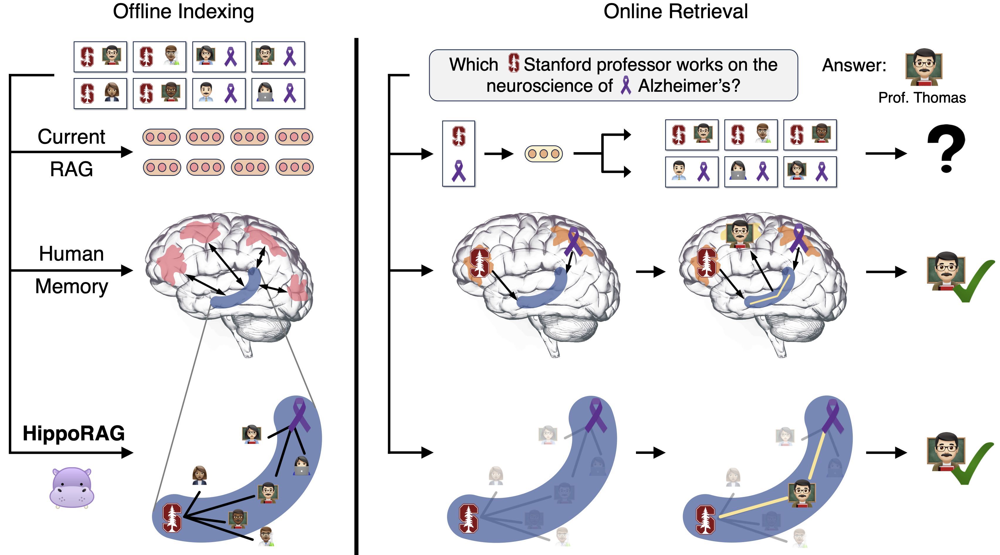

<h1 align="center">  HippoRAG <br> Neurobiologically Inspired Long-Term Memory <br> for Large Language Models</h1>

HippoRAG is a novel **retrieval augmented generation (RAG)** framework inspired by the neurobiology of human long-term memory that enables LLMs to continuously **integrate knowledge across external documents**. Our experiments suggest that HippoRAG could provide RAG systems with capabilities that usually require a costly and high-latency iterative LLM pipeline for only a fraction of the computational cost.

For more details, check out our <a href="https://arxiv.org/abs/2405.14831">paper</a>!



## Setup Environment

Create a conda environment and install dependency:

```shell
conda create -n hipporag python=3.9
conda activate hipporag
pip install -r requirements.txt

GPUS=0,1,2,3 #Replace with your own free GPU Devices
```

Add conda env to PATH as follows, where `/path/HippoRAG` is the root of HippoRAG, and `/path/HippoRAG/hipporag` is the path to the cond env. Consider adding this to your ~/.bashrc
```shell
export PATH=$PATH:/path/HippoRAG/hipporag/bin 
```

Setup LLM API keys: TOGETHER_API_KEY is optional and set it when you want to use their open-source models (e.g., Llama-3).

```shell
export OPENAI_API_KEY='Add your own OpenAI API key here.'
export TOGETHER_API_KEY='Add your own TogetherAI API key here.'
```

To use ColBERTv2, download the pre-trained [checkpoint](https://downloads.cs.stanford.edu/nlp/data/colbert/colbertv2/colbertv2.0.tar.gz) and put it under `exp/colbertv2.0`.

```shell
cd exp
wget https://downloads.cs.stanford.edu/nlp/data/colbert/colbertv2/colbertv2.0.tar.gz
tar -xvzf colbertv2.0.tar.gz
cd .. # get back to the root
```

## Using HippoRAG

**Note that the working directory is HippoRAG root for the following commands.**

### Setting up your data

To setup your own retrieval corpus, follow the format and naming convention shown in `data/sample_corpus.json` (your dataset's name should be followed by `_corpus.json`). If running an experiment with pre-defined questions, organize your query corpus according to the query file `data/sample.json`, be sure to also follow our naming convention.

The corpus and optional query JSON files should have the following format:

#### Retrieval Corpus JSON

```json
[
  {
    "title": "FIRST PASSAGE TITLE",
    "text": "FIRST PASSAGE TEXT",
    "idx": 0
  },
  {
    "title": "SECOND PASSAGE TITLE",
    "text": "SECOND PASSAGE TEXT",
    "idx": 1
  }
]
```

#### (Optional) Query JSON

```json

[
  {
    "id": "sample/question_1.json",
    "question": "QUESTION",
    "answer": [
      "ANSWER"
    ],
    "answerable": true,
    "paragraphs": [
      {
        "title": "{FIRST SUPPORTING PASSAGE TITLE}",
        "text": "{FIRST SUPPORTING PASSAGE TEXT}",
        "is_supporting": true,
        "idx": 0
      },
      {
        "title": "{SECOND SUPPORTING PASSAGE TITLE}",
        "text": "{SECOND SUPPORTING PASSAGE TEXT}",
        "is_supporting": true,
        "idx": 1
      }
    ]
  }
]
```

#### (Optional) Chunking Corpus

When preparing your corpus data, you may need to chunk each passage, as longer passage maybe too complex for the OpenIE process. Check `src/data_process/util.py` to chunk your whole corpus if you need.

### Integration with LangChain

This codebase calls LLM through [LangChain](https://www.langchain.com/), which makes it easier for HippoRAG to call different online LLM APIs or offline LLM deployments.
See `src/langchain_util.py` to see how we set OpenAI and TogetherAI for our experiments. You could also set up your LLM choices using LangChain, e.g., [Ollama](https://python.langchain.com/v0.1/docs/integrations/chat/ollama/) supports **local** Llama, Gemma and Mistral models. 

### Indexing

Once your corpus is created, add it under the `data` directory. We are now ready to start indexing using the commands below.

We will use the best hyperparameters defined in our paper and assume your dataset name is `sample`.

For the following commands,
you don't have to index with both ColBERTv2 and Contriever. Choose one of them based on your preference.

#### Indexing with ColBERTv2 for Synonymy Edges

```shell
DATA=sample
LLM=gpt-3.5-turbo-1106
SYNONYM_THRESH=0.8
GPUS=0,1,2,3
LLM_API=openai # LLM API provider e.g., 'openai', 'together', see 'src/langchain_util.py'

bash src/setup_hipporag_colbert.sh $DATA $LLM $GPUS $SYNONYM_THRESH $LLM_API
```

#### Indexing with HuggingFace Retrieval Encoder for Synonymy Edges (i.e. Contriever)

```shell
DATA=sample
HF_RETRIEVER=facebook/contriever
LLM=gpt-3.5-turbo-1106
SYNONYM_THRESH=0.8
GPUS=0,1,2,3
LLM_API=openai # LLM API provider e.g., 'openai', 'together', see 'src/langchain_util.py'

bash src/setup_hipporag.sh $DATA $HF_RETRIEVER $LLM $GPUS $SYNONYM_THRESH $LLM_API
```

### Retrieval

After indexing, HippoRAG is ready to aid with online retrieval. Below, we provide two strategies for using HippoRAG:
1. Running retrieval on a set of **pre-defined queries**.
2. Integrating directly with our API to receive queries from users. 

#### Pre-Defined Queries

To run retrieval on a specific set of **pre-defined queries** in the format described above, we run either of the following commands depending on which retrieval backbone you want to use:

ColBERTv2
```shell
RETRIEVER=colbertv2

python3 src/ircot_hipporag.py --dataset $DATA --retriever $RETRIEVER --llm $LLM_API --llm_model $LLM --max_steps 1 --doc_ensemble f --top_k 10  --sim_threshold $SYNONYM_THRESH --damping 0.5
```

Huggingface Model (i.e. Contriever)

```shell
RETRIEVER=$HF_RETRIEVER

python3 src/ircot_hipporag.py --dataset $DATA --retriever $RETRIEVER --llm $LLM_API --llm_model $LLM --max_steps 1 --doc_ensemble f --top_k 10 --sim_threshold $SYNONYM_THRESH --damping 0.5
```

**Note:** In this setting, you can couple HippoRAG with IRCoT for complementary improvements. To run this, just change the `--max_steps` parameter above to the desired maximum number of LLM reasoning steps. Additionally, be sure to make a directory with your dataset's name under `data/ircot_prompt/` and add a file named `gold_with_3_distractors_context_cot_qa_codex.txt` with IRCoT prompts appropriate for your dataset. Check out the other datasets' IRCoT prompts for formatting and content inspiration.

#### HippoRAG Integration

We provide an example in `src/test_hipporag.py` to guide users who would like to integrate the HippoRAG API with their codebase directly.

```python

from src.langchain_util import LangChainModel
from src.qa.qa_reader import qa_read

import argparse

from src.hipporag import HippoRAG

if __name__ == '__main__':
    parser = argparse.ArgumentParser()
    parser.add_argument('--dataset', type=str, required=True, default='sample')
    parser.add_argument('--extraction_model', type=str, default='gpt-3.5-turbo-1106')
    parser.add_argument('--retrieval_model', type=str, required=True, help='e.g., "facebook/contriever", "colbertv2"')
    parser.add_argument('--doc_ensemble', action='store_true')
    parser.add_argument('--dpr_only', action='store_true')
    args = parser.parse_args()

    assert not (args.doc_ensemble and args.dpr_only)
    hipporag = HippoRAG(args.dataset, 'openai', args.extraction_model, args.retrieval_model, doc_ensemble=args.doc_ensemble, dpr_only=args.dpr_only,
                        qa_model=LangChainModel('openai', 'gpt-3.5-turbo'))

    queries = ["Which Stanford University professor works on Alzheimer's"]
    # qa_few_shot_samples = [{'document': '', 'question': '', 'thought': '', 'answer': ''}]
    # Prepare a list for few-shot QA, where each element is a dict with keys 'document', 'question', 'thought', 'answer' ('document' and 'thought' are optional)
    qa_few_shot_samples = None

    for query in queries:
        ranks, scores, logs = hipporag.rank_docs(query, top_k=10)
        retrieved_passages = [hipporag.get_passage_by_idx(rank) for rank in ranks]

        response = qa_read(query, retrieved_passages, qa_few_shot_samples, hipporag.qa_model)
        print(ranks)
        print(scores)
        print(response)
```

To initiate an instance of the HippoRAG class, just choose an **LLM** and a **retrieval encoder model** which you have used to previously index your retrieval dataset.

### Demo on Custom Datasets

To run HippoRAG on a custom dataset, follow the indexing and retrieval steps as described above, and also add data processing and evaluation as follows. Here's an example for [BEIR](https://arxiv.org/abs/2104.08663) datasets, see `src/data_process` and `src/demo`.

## Paper Reproducibility

In this section, you will find all the code necessary to reproduce the results shown in [our paper](https://arxiv.org/abs/2405.14831).  

### Data

We provide all the necessary data to reproduce our experiments. 

To save cost and time in reproducibility efforts, we also include the knowledge graphs generated via open IE with GPT-3.5 Turbo (1106), both Llama-3 models and REBEL on all three subsets and the hyperparameter tuning dataset. We also include the NER results obtained via GPT-3.5 Turbo (1106) on all datasets.

### Baselines

Please check `src/baselines/README.md` for more details.

### Running HippoRAG

Using our HippoRAG framework requires a two-step process, indexing and retrieval.

#### Indexing

To run indexing for both our main experiments and our ablations, run the following bash scripts. Retrieval will fail if this step does not succeed.

```shell
bash src/setup_hipporag_main_exps.sh $GPUS
```

#### HippoRAG Retrieval

After running indexing, run the following bash scripts to test both single-step and multi-step retrieval using HippoRAG with both Contriever and ColBERTv2. 

##### HippoRAG Only
```shell
bash src/run_hipporag_main_exps.sh
```

##### HippoRAG w/ IRCoT

```shell
bash src/run_hipporag_ircot_main_exps.sh
```

##### Ablation Experiments

To run all our ablations, run the following bash scripts:

```shell
bash src/setup_hipporag_ablations.sh $GPUS
bash src/run_hipporag_ablations.sh
```

### Hyperparameter Tuning

To reproduce our hyperparameter tuning, we must first run indexing on the MuSiQue training subset by running the following script:

```shell
bash src/setup_hipporag_hyperparameter_tune.sh $GPUS
```

After indexing is completed, run the following script and note the performance of each hyperparameter combination tested.

```shell
bash src/run_hipporag_hyperparameter_tune.sh
```

### Question Answering

Please check `src/qa/README.md` for more details. Running QA can only be done after running retrieval on baselines and HippoRAG since it uses the output of retrieval.

### Path-Finding Multi-Hop QA Case Study

To run the case study examples shown in our paper, which we also include in our data directory, run the following scripts. Note that to run these examples, it will be necessary to set your own OpenAI API Key.

#### Indexing

```shell
bash src/setup_hipporag_case_study.sh $GPUS
```

#### Retrieval

```shell
bash src/run_hipporag_case_study.sh
```

After running these, you can explore the outputs inside the `output/ircot/` directory.


## TODO

- [ ] Locally Deployed LLMs
- [ ] Prompt Flexibility
- [ ] Supporting Graph DB, e.g., Neo4j
- [ ] Read/Write APIs for the graph
      
## Contact

Questions or issues? File an issue or contact 
[Bernal Jiménez Gutiérrez](mailto:jimenezgutierrez.1@osu.edu),
[Yiheng Shu](mailto:shu.251@osu.edu),
[Yu Su](mailto:su.809@osu.edu),
The Ohio State University

## Citation

If you find this work useful, please consider citing our paper:

```
@article{gutiérrez2024hipporag,
      title={HippoRAG: Neurobiologically Inspired Long-Term Memory for Large Language Models}, 
      author={Bernal Jiménez Gutiérrez and Yiheng Shu and Yu Gu and Michihiro Yasunaga and Yu Su},
      journal={arXiv preprint arXiv:2405.14831},
      year={2024},
      url={https://arxiv.org/abs/2405.14831}
}
```
